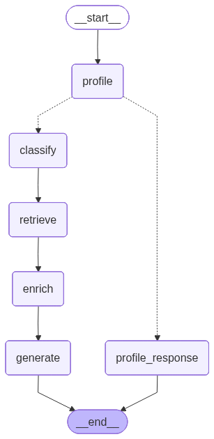

[← Voltar ao README](../README.md)

# Arquitetura do DoaZap

## Visão Geral

```
┌─────────────┐     ┌──────────────┐     ┌─────────────────┐
│  WhatsApp   │────▶│   Z-API      │────▶│  FastAPI        │
│  (Usuário)  │◀────│  (Webhook)   │◀────│  (Backend)      │
└─────────────┘     └──────────────┘     └────────┬────────┘
                                                  │
                                          ┌───────┴─────────┐
                                          │                 │
                                    ┌─────▼─────┐    ┌──────▼──────┐
                                    │ LangGraph │    │ PostgreSQL  │
                                    │ (Agente)  │    │ (Dados)     │
                                    └─────┬─────┘    └─────────────┘
                                          │
                                    ┌─────▼──────┐
                                    │  RAG /     │
                                    │  FAISS     │
                                    └────────────┘
```

## Fluxo de uma Mensagem

1. Usuário envia mensagem no WhatsApp
2. Z-API recebe e dispara webhook `POST /api/webhook`
3. FastAPI recebe o payload e aplica filtros sequenciais:
   - **`instanceId` inválido** → rejeitado silenciosamente (valida que veio da instância Z-API configurada)
   - Mensagens `fromMe` ou de grupo → ignoradas silenciosamente
   - **Mídia** (áudio, vídeo, imagem, documento, sticker) → envia aviso ao usuário e encerra
   - **Rate limit** excedido (≥ 5 msgs/60s do mesmo número, via banco de dados) → ignorado silenciosamente
   - Sem texto → ignorado silenciosamente
   - **Bot detectado** por auto-identificação na mensagem → ignorado silenciosamente
   - `messageId` já processado → descartado (deduplicação de webhook duplicado pelo Z-API)
   - **Circuit breaker OOS** ativado (3 respostas consecutivas "Fora do Escopo" em 1 min) → ignorado silenciosamente
4. Busca/cria sessão de conversa no PostgreSQL
5. Salva a mensagem inbound com o `messageId` do Z-API (garante idempotência)
6. Recupera histórico das últimas mensagens da conversa (memória conversacional)
7. Agente LangGraph processa a mensagem:
   - **Profile** — verifica/coleta o nome do usuário nas primeiras interações:
     - **1ª mensagem** (`greeting`): apresenta o DoaZap, reconhece brevemente a intenção e pede o nome
     - **2ª mensagem** (`collecting_name`): pede o nome novamente se não foi fornecido
     - Nome extraído via LLM (`EXTRACT_NAME_PROMPT`) e persistido no banco
   - **Classify** — GPT-4.1-mini identifica intent e sentimento (com guard-rails)
   - **Retrieve** — FAISS busca interações similares na base RAG
   - **Enrich** — Consulta ONGs parceiras no banco conforme o intent
   - **Generate** — GPT-4.1-mini gera resposta contextualizada com dados reais das ONGs
8. Resposta é salva no banco e enviada via Z-API

## Grafo do Agente LangGraph



O grafo possui dois caminhos a partir do nó `profile`:

- **Fluxo de coleta de nome** (1ª e 2ª mensagem): `profile` → `profile_response` → `END`
- **Fluxo principal** (usuário já identificado): `profile` → `classify` → `retrieve` → `enrich` → `generate` → `END`

Para regenerar o diagrama:

```bash
python scripts/generate_graph.py
```

## Intents Suportados

| Intent | Descrição |
|--------|-----------|
| Quero Doar | Doação via PIX, transferência, roupas, alimentos |
| Busco Ajuda/Beneficiário | Usuário precisa de assistência |
| Voluntariado | Interesse em ser voluntário |
| Parceria Corporativa | Empresa buscando parceria |
| Informação Geral | Perguntas sobre as ONGs parceiras e seus projetos |
| Ambíguo | Mensagem sem intenção clara relacionada à plataforma |
| Fora do Escopo | Mensagem não relacionada a doações, ONGs ou assistência social |

## Guard-Rails e Segurança

O sistema possui cinco camadas de proteção independentes no webhook, mais uma camada no agente. Consulte [SECURITY.md](SECURITY.md) para o detalhamento completo das medidas de segurança.

**Camada 0 — Validação de origem do webhook (v1.5.9):** Cada payload é validado contra o `instanceId` da instância Z-API configurada. Requisições de origens desconhecidas são rejeitadas silenciosamente antes de qualquer processamento.

**Camada 1 — Rate limiting persistente via banco de dados (webhook):** Máximo de 5 mensagens por 60 segundos por número de telefone, contabilizadas diretamente na tabela `messages`. Por ser baseado no banco de dados, o limite sobrevive a reinicializações do processo (ex.: novos deploys no Render). Excedido o limite, a mensagem é descartada silenciosamente, sem resposta.

**Camada 2 — Detecção de bot por auto-identificação (webhook):** Mensagens que contêm frases típicas de assistentes virtuais ou CRMs automatizados são descartadas silenciosamente antes de qualquer processamento pelo agente. Padrões detectados: "sou a analista virtual", "sou um assistente virtual", "atendente virtual da…", "link de pagamento gerado", "qual é o seu nível de satisfação", "número de protocolo", entre outros.

**Camada 3 — Circuit breaker por "Fora do Escopo" consecutivo (webhook):** Se as últimas 3 respostas outbound para um número forem todas classificadas como "Fora do Escopo" dentro de 1 minuto, a próxima mensagem desse número é silenciada sem chamar o agente e sem enviar resposta. Isso interrompe loops onde um bot externo continua respondendo após múltiplas recusas.

**Camada 4 — Limite de tentativas de coleta de nome (agente):** O estágio de coleta do nome do usuário tem no máximo 3 tentativas. Após esse limite, o bot prossegue o atendimento normalmente sem nome, evitando o loop infinito caso um bot externo não consiga fornecer uma resposta válida.

**Guard-rails do agente (LLM):** Mensagens classificadas como "Fora do Escopo" recebem uma resposta gentil de redirecionamento, sem acesso ao banco de ONGs.

Padrões bloqueados automaticamente:

- Perguntas de cultura pop, esportes, ciência geral, política
- Tentativas de **prompt injection** ("ignore suas instruções…")
- Tentativas de **jailbreak** ("DAN", "modo sem restrições"…)
- Impersonação de outro bot ou serviço externo (cobranças, boletos)
- Solicitação do prompt de sistema ou de outra identidade

## Tratamento de Mídia

Mensagens de áudio, vídeo, imagem, documento ou sticker são identificadas pelo tipo do payload Z-API e recebem uma resposta automática informando que o bot processa apenas texto. O agente não é acionado para esse tipo de conteúdo.

## Resiliência do Webhook

O Z-API pode reenviar o mesmo webhook quando o servidor demora a responder. Para evitar respostas duplicadas, cada mensagem inbound é gravada com o `messageId` do Z-API (campo único no banco). Webhooks com `messageId` já registrado são descartados imediatamente, antes de qualquer chamada ao agente.

---

[← Voltar ao README](../README.md)
